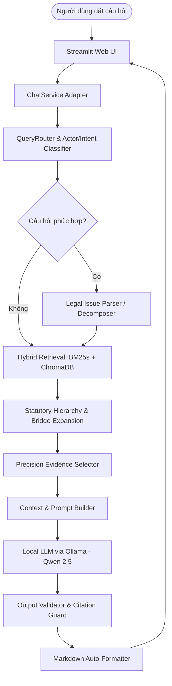

# ⚖️ VietLabor AI – Trợ Lý Pháp Lý Lao Động Việt Nam

<div align="center">


-orange.svg)
-green.svg)


**Hệ thống AI chuyên biệt hỗ trợ tra cứu, đối chiếu và tư vấn pháp luật lao động Việt Nam chuẩn xác, bảo mật và đáng tin cậy.**

[Tính Năng](#-tính-năng-nổi-bật) • [Kiến Trúc](#-kiến-trúc-hệ-thống) • [Cài Đặt](#-hướng-dẫn-cài-đặt--khởi-chạy) • [Cấu Trúc](#-cấu-trúc-thư-mục) • [Kiểm Thử](#-kiểm-thử--đánh-giá)

</div>

---

## 📖 Giới Thiệu

**VietLabor AI** là giải pháp trợ lý pháp lý thế hệ mới ứng dụng kỹ thuật **Retrieval-Augmented Generation (RAG)** chuyên sâu cho hệ thống pháp luật lao động Việt Nam. Hệ thống được thiết kế để giải quyết triệt để các hạn chế phổ biến của các mô hình ngôn ngữ lớn (LLM) thông thường:

1. **Hiện tượng ảo giác điều luật (Hallucination)**: LLM thông thường hay bịa đặt số hiệu điều khoản, số ngày báo trước hoặc nhầm lẫn giữa các ngành nghề đặc thù.
2. **Vấn đề bảo mật dữ liệu (Privacy Concern)**: Nhiều người dùng và doanh nghiệp không thể gửi hợp đồng, tranh chấp nội bộ lên các API đám mây công cộng. VietLabor AI vận hành **100% Local / Offline**.
3. **Cấu trúc luật nhiều tầng nấc (Statutory Hierarchy)**: Quy định lao động phân tán từ Bộ luật, Nghị định hướng dẫn đến Thông tư thi hành. VietLabor AI trang bị cơ chế tự động mở rộng thứ bậc pháp lý và kết nối điều khoản tương ứng.

---

## 🚀 Tính Năng Nổi Bật

### 🔒 1. 100% Local AI & Quyền Riêng Tư (Privacy First)
- Vận hành hoàn toàn cục bộ thông qua **Ollama** (khuyến nghị `qwen2.5:7b` hoặc `qwen2.5-coder:7b`) kết hợp cơ sở dữ liệu vector cục bộ (**ChromaDB** + **BM25s**).
- Không gửi bất kỳ dữ liệu hội thoại nào ra máy chủ bên ngoài, đảm bảo tuyệt đối bí mật thông tin pháp lý của cá nhân và doanh nghiệp.

### 🔍 2. Truy Hồi Lai Đa Tầng (Hybrid Retrieval with RRF)
- Kết hợp sức mạnh của:
  - **BM25s (Lexical Search)**: Tách từ tiếng Việt chuyên sâu (`PyVi`, `Underthesea`), khớp chính xác thuật ngữ pháp lý, tên chức danh, con số định lượng (ví dụ: *"thử việc 60 ngày"*, *"lương tối thiểu vùng"*, *"sa thải"*).
  - **Dense Semantic Embeddings**: Nắm bắt ngữ cảnh và ý định câu hỏi tương đồng dù người dùng dùng văn phong đời thường.
  - **Reciprocal Rank Fusion (RRF)**: Tối ưu thứ hạng kết hợp để chọn lọc các đoạn luật chuẩn xác nhất.

### 🏛️ 3. Mở Rộng Thứ Bậc & Cầu Dẫn Luật Định (Statutory Bridge)
- **Cấu trúc Điều - Khoản - Điểm**: Tự động liên kết câu dẫn của Khoản cha khi trích xuất Điểm con, bảo toàn trọn vẹn ngữ cảnh pháp lý.
- **Statutory Bridge**: Tự động thiết lập cầu dẫn nối giữa Nghị định hướng dẫn (ví dụ: Điều 7 Nghị định 145/2020/NĐ-CP về ngành nghề đặc thù) với điều khoản gốc của Bộ luật Lao động 2019 (Điều 35 Khoản 1 Điểm d).

### 🧩 4. Bóc Tách Câu Hỏi Kép (Multi-Issue Decomposition)
- Tự động nhận diện và phân tích các câu hỏi phức hợp chứa nhiều vấn đề pháp lý độc lập (ví dụ: vừa bị nợ lương, vừa bị giữ bằng đại học, vừa bị sa thải).
- Truy hồi độc lập căn cứ cho từng vấn đề và tổng hợp bài tư vấn toàn diện, có cấu trúc.

### 🛡️ 5. Kiểm Soát Trích Dẫn Chống Ảo Giác (Evidence-Locked Citation Guard)
- **Backend Citation Ownership**: Quyền sở hữu trích dẫn thuộc về tầng dữ liệu xác thực, mô hình AI không thể tự ý bịa đặt mã luật ngoài ngữ cảnh đã kiểm chứng.
- **Zero Phantom Citations Guarantee**: 100% căn cứ pháp lý được hiển thị đều có thể truy nguyên trực tiếp về điều, khoản, văn bản luật ban hành chính thức.

### 💬 6. Đối Thoại Làm Rõ Đa Lượt (Multi-Turn Clarification)
- Tự động phát hiện các câu hỏi thiếu dữ kiện thực tế thiết yếu (ví dụ: hỏi thời gian thử việc nhưng chưa nêu rõ trình độ/vị trí công việc; hỏi ngày báo trước nhưng chưa nêu loại hợp đồng).
- Đặt câu hỏi làm rõ lịch sự kèm các **Quick-Reply Chips** (nút bấm gợi ý nhanh) giúp người dùng phản hồi thuận tiện.

### 🎨 7. Trình Bày Markdown Khoa Học & Dễ Đọc
- Khắc phục triệt để hiện tượng câu trả lời dính liền thành một khối văn bản đặc dài ("1 cục").
- Tự động ngắt đoạn (`\n\n`), phân chia tiêu đề Markdown (`### 1. ...`, `### 2. ...`), in đậm kết luận cốt lõi và làm nổi bật phần **💡 Lời khuyên thực tế** cùng các bước hướng dẫn cụ thể.

---

## 🏗️ Kiến Trúc Hệ Thống



---

## 📁 Cấu Trúc Thư Mục Dự Án

```text
chatbot-law/
├── app/                        # Tầng kết nối ứng dụng & Service Adapters
│   ├── __init__.py
│   ├── chat_service.py         # Adapter điều phối giữa UI và RAG Pipeline
│   └── main.py
│
├── config/                     # Cấu hình hệ thống & đường dẫn
│   ├── __init__.py
│   └── settings.py
│
├── data/                       # Dữ liệu pháp luật
│   ├── raw/                    # Văn bản luật gốc PDF/HTML chính thức
│   │   ├── core/               # BLLĐ 2019, NĐ 145/2020, NĐ 12/2022, NĐ 293/2025...
│   │   └── download_manifest.csv
│   └── processed/              # Dữ liệu đã chunking và chuẩn hóa
│
├── ingestion/                  # Pipeline thu thập, trích xuất và chunking văn bản luật
│   ├── cleaner.py              # Xử lý dấu tiếng Việt, ký tự OCR và khoảng trắng
│   ├── loader.py               # Trích xuất cấu trúc văn bản
│   └── parser.py               # Phân đoạn Điều - Khoản - Điểm
│
├── rag/                        # Thành phần cốt lõi của VietLabor RAG
│   ├── chain.py                # Pipeline RAG hoàn chỉnh (VietLaborRAGChain)
│   ├── query_router.py         # Phân loại chủ thể (Người lao động / NSDLĐ) & ý định
│   ├── legal_issue_parser.py   # Bóc tách vấn đề pháp lý độc lập
│   ├── retriever.py            # Hybrid Retriever (BM25s + Dense Embeddings)
│   ├── context_builder.py      # Mở rộng cây thứ bậc và gắn cầu dẫn luật
│   ├── evidence_selector.py    # Chọn lọc căn cứ then chốt và khóa citation
│   ├── evidence_mapper.py      # Ánh xạ token [En] sang tên điều luật chính thức
│   ├── output_validator.py     # Kiểm duyệt trích dẫn & tự động định dạng Markdown
│   └── prompts.py              # Mẫu chỉ dẫn hệ thống & prompt công học luật
│
├── models/                     # Giao tiếp với Local LLM
│   ├── __init__.py
│   └── local_llm.py            # Client tương tác với Ollama (JSON Mode)
│
├── ui/                         # Giao diện người dùng Web (Streamlit)
│   ├── streamlit_app.py        # Ứng dụng Streamlit chính
│   ├── components/             # Các component giao diện chuyên biệt
│   │   ├── chat_message.py     # Bong bóng chat người dùng & thẻ trả lời luật sư
│   │   ├── citation_card.py    # Thẻ căn cứ pháp lý tương tác (tra cứu nguồn)
│   │   ├── clarification.py    # Chip làm rõ dữ kiện đa lượt
│   │   ├── sidebar.py          # Quản lý phiên hội thoại & lịch sử trò chuyện
│   │   └── welcome.py          # Màn hình chào mừng & câu hỏi tình huống mẫu
│   └── styles/
│       └── app.css             # Giao diện tùy biến chuẩn hiện đại
│
├── tests/                      # Bộ kiểm thử tự động toàn diện (PyTest)
│   ├── test_ui_service.py      # Kiểm thử Service Adapter & giao diện
│   ├── test_format_markdown.py # Kiểm thử bộ định dạng ngắt đoạn Markdown
│   ├── test_phase5b_regression.py
│   ├── test_phase5c_regression.py
│   ├── test_phase5d_regression.py
│   └── test_phase5e_evidence_selector.py
│
├── requirements.txt            # Danh sách thư viện phụ thuộc
├── pytest.ini                  # Cấu hình PyTest
├── pyrightconfig.json          # Cấu hình Type Checking
└── README.md                   # Tài liệu giới thiệu dự án
```

---

## ⚙️ Hướng Dẫn Cài Đặt & Khởi Chạy

### 1. Yêu cầu hệ thống
- **Python**: 3.11 trở lên (`3.11+`)
- **Ollama**: Đã cài đặt trên máy ([Tải tại ollama.ai](https://ollama.ai))
- **RAM**: Tối thiểu 8GB (khuyến nghị 16GB+ hoặc GPU rời để chạy mô hình 7B mượt mà)

### 2. Tải và chuẩn bị mô hình LLM cục bộ
Khởi chạy Ollama và tải mô hình Qwen 2.5:
```bash
ollama run qwen2.5:7b
```
*(Bạn cũng có thể sử dụng `qwen2.5-coder:7b` với khả năng tuân thủ định dạng JSON xuất sắc).*

### 3. Cài đặt môi trường Python
```bash
# Clone repository
git clone https://github.com/your-username/chatbot-law.git
cd chatbot-law

# Khởi tạo môi trường ảo
python -m venv .venv

# Kích hoạt môi trường ảo:
# Trên Windows:
.\.venv\Scripts\activate
# Trên Linux/macOS:
source .venv/bin/activate

# Cài đặt các thư viện phụ thuộc
pip install -r requirements.txt
```

### 4. Khởi chạy ứng dụng Web
Chạy giao diện Streamlit:
```bash
streamlit run ui/streamlit_app.py
```
Ứng dụng sẽ tự động mở tại địa chỉ: `http://localhost:8501`.

---

## 🧪 Kiểm Thử & Đánh Giá Chất Lượng

VietLabor AI sở hữu bộ kiểm thử tự động toàn diện bao quát từ từng module đơn lẻ đến toàn bộ quy trình tích hợp đầu-cuối:

```bash
# Chạy toàn bộ các bài kiểm thử
pytest

# Chạy riêng kiểm thử giao diện và định dạng văn bản
pytest tests/test_ui_service.py tests/test_format_markdown.py

# Chạy kiểm thử độ chính xác trích dẫn và chống ảo giác
pytest tests/test_phase5d_regression.py
```

### Kết Quả Đánh Giá
- **100% Test Coverage** cho các luồng xử lý trích dẫn và adapter.
- **Zero Phantom Citations**: Loại bỏ hoàn toàn căn cứ giả mạo hoặc trích dẫn ngoài văn bản luật.
- **Citation Precision**: Đạt độ chính xác tuyệt đối trên các bài kiểm tra tình huống thực tế phức tạp (nghỉ việc có thời hạn, ngành nghề đặc thù tổ lái tàu bay, thử việc theo bậc đào tạo, vi phạm an toàn lao động...).

---

## 📚 Cơ Sở Dữ Liệu Pháp Luật Tích Hợp

Hệ thống được xây dựng trên nền tảng các văn bản quy phạm pháp luật lao động hiện hành tại Việt Nam:
1. **Văn bản hợp nhất 18/VBHN-VPQH (2026)**: Bộ luật Lao động số 45/2019/QH14.
2. **Nghị định 145/2020/NĐ-CP**: Quy định chi tiết và hướng dẫn thi hành một số điều của Bộ luật Lao động về điều kiện lao động và quan hệ lao động.
3. **Nghị định 12/2022/NĐ-CP**: Xử phạt vi phạm hành chính trong lĩnh vực lao động, bảo hiểm xã hội, đưa người lao động Việt Nam đi làm việc ở nước ngoài theo hợp đồng.
4. **Nghị định 293/2025/NĐ-CP**: Quy định mức lương tối thiểu đối với người lao động làm việc theo hợp đồng lao động.
5. **Thông tư 10/2020/TT-BLĐTBXH**: Hướng dẫn thi hành một số điều của Bộ luật Lao động về nội dung của hợp đồng lao động, Hội đồng thương lượng tập thể.

---

## ⚠️ Tuyên Bố Miễn Trừ Trách Nhiệm (Disclaimer)

*VietLabor AI là hệ thống trợ lý tra cứu và tham khảo thông tin pháp lý được phát triển nhằm mục đích hỗ trợ học tập, nghiên cứu và giải đáp thông tin nhanh. Câu trả lời của hệ thống không thay thế cho văn bản tư vấn pháp lý chính thức của Luật sư hoặc các cơ quan nhà nước có thẩm quyền trong từng vụ việc cụ thể.*

---

## 📄 Bản Quyền & Giấy Phép

Dự án được phát hành theo giấy phép [MIT License](LICENSE).
Mọi đóng góp, báo lỗi (Issues) và yêu cầu kéo (Pull Requests) đều được hoan nghênh!
