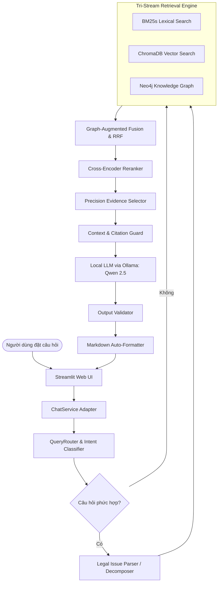

# ⚖️ VietLabor AI – Trợ Lý Pháp Lý Lao Động Việt Nam (Hybrid GraphRAG)

<div align="center">


-orange.svg)
-purple.svg)


**Hệ thống AI chuyên biệt hỗ trợ tra cứu, đối chiếu và tư vấn pháp luật lao động Việt Nam chuẩn xác, bảo mật với kiến trúc Hybrid GraphRAG tiên tiến (ChromaDB + BM25s + Neo4j Knowledge Graph).**

[Tính Năng](#-tính-năng-nổi-bật) • [Kiến Trúc Hybrid GraphRAG](#-kiến-trúc-hệ-thống) • [Bản Thể Học Pháp Lý](#-bản-thể-học-pháp-lý-legal-ontology) • [Cấu Trúc](#-cấu-trúc-thư-mục) • [Cài Đặt](#-hướng-dẫn-cài-đặt--khởi-chạy) • [Kiểm Thử](#-kiểm-thử--đánh-giá)

</div>

---

## 📖 Giới Thiệu

**VietLabor AI** là giải pháp trợ lý pháp lý thế hệ mới ứng dụng kỹ thuật **Hybrid GraphRAG (Retrieval-Augmented Generation kết hợp Knowledge Graph)** chuyên sâu cho hệ thống pháp luật lao động Việt Nam. Hệ thống được thiết kế phục vụ nghiên cứu học thuật và đồ án chuyên sâu, giải quyết triệt để các hạn chế phổ biến của các mô hình ngôn ngữ lớn (LLM) và các hệ thống RAG thông thường:

1. **Hiện tượng ảo giác điều luật (Hallucination)**: LLM thông thường hay bịa đặt số hiệu điều khoản, số ngày báo trước hoặc nhầm lẫn giữa các ngành nghề đặc thù.
2. **Suy luận quan hệ đa tầng (Multi-hop Reasoning)**: RAG dạng vector truyền thống thường thất bại khi câu hỏi đòi hỏi kết nối nhiều văn bản (Ví dụ: Hành vi vi phạm tại Bộ luật Lao động $\rightarrow$ Mức phạt hành chính tại Nghị định 12/2022/NĐ-CP $\rightarrow$ Hướng dẫn đặc thù tại Nghị định 145/2020/NĐ-CP).
3. **Bảo toàn ngữ cảnh thứ bậc (Statutory Hierarchy)**: Tự động gắn kết câu dẫn Khoản cha khi trích xuất Điểm con, loại bỏ hiện tượng trích dẫn cụt ý.
4. **Vận hành cục bộ 100% (Local-first & Privacy)**: Không gửi dữ liệu hội thoại ra internet; LLM, Vector DB và Graph DB đều chạy trên hạ tầng máy tính nội bộ.

---

## 🚀 Tính Năng Nổi Bật

### 🌐 1. Kiến Trúc Truy Hồi Tam Hợp (Tri-Stream Hybrid Retrieval)
Hệ thống tích hợp 3 luồng truy hồi dữ liệu song song nhằm tối ưu hóa độ bao phủ và độ chính xác:
* **Dense Vector Search (ChromaDB + BGE-M3)**: Nắm bắt ngữ cảnh và ý định tương đồng về mặt ngữ nghĩa dù người dùng diễn đạt bằng ngôn ngữ đời thường.
* **Sparse Lexical Search (BM25s + PyVi/Underthesea)**: Bắt chính xác từng thuật ngữ định lượng ("thử việc 60 ngày", "báo trước 45 ngày", "lương tối thiểu vùng", mã số điều luật).
* **Knowledge Graph Traversal (Neo4j)**: Truy vết theo mạng lưới đồ thị tri thức để tìm kiếm văn bản hướng dẫn thi hành (Statutory Bridge) và chế tài xử phạt tương ứng (Penalty links).
* **Reciprocal Rank Fusion (RRF) & Reranking**: Hợp nhất thứ hạng đa luồng và tái xếp hạng bằng Cross-Encoder.

### 🏛️ 2. Đồ Thị Tri Thức & Cầu Dẫn Luật Định (Statutory Bridge via Neo4j)
* **Mô hình hóa quan hệ đa tầng**: Thiết lập liên kết giữa các văn bản quy phạm pháp luật theo đúng tôn ti trật tự pháp điển (Luật $\rightarrow$ Nghị định $\rightarrow$ Thông tư).
* **Truy vết chế tài tự động**: Khi phát hiện hành vi vi phạm điều luật (ví dụ: giam lương, giữ bằng gốc, sa thải trái phép), hệ thống tự động dò đồ thị sang Nghị định xử phạt vi phạm hành chính để trích xuất khung tiền phạt và biện pháp khắc phục hậu quả.

### 🧩 3. Bóc Tách Câu Hỏi Đa Vấn Đề (Multi-Issue Decomposition)
* Tự động phân tích các tình huống pháp lý phức tạp chứa nhiều hành vi độc lập (vừa bị chậm lương, vừa bị giữ giấy tờ, vừa bị ép thôi việc).
* Chia nhỏ thành các sub-queries, truy hồi độc lập và tổng hợp bài tư vấn có cấu trúc logic mạch lạc.

### 🛡️ 4. Khóa Trích Dẫn Chống Ảo Giác (Evidence-Locked Citation Guard)
* **Backend Citation Ownership**: Quyền sở hữu trích dẫn thuộc về tầng dữ liệu xác thực, mô hình LLM không được tự ý bịa đặt điều luật ngoài phạm vi bằng chứng đã được kiểm chứng.
* **Cổng kiểm tra độ phủ căn cứ**: Tự động hạ kết luận thành "chưa đủ căn cứ" nếu thiếu điều luật đối chiếu thực tế.

### 💬 5. Đối Thoại Làm Rõ Đa Lượt (Multi-Turn Clarification)
* Nhận diện khi người dùng cung cấp thiếu dữ kiện trọng yếu (chưa rõ loại hợp đồng, chưa rõ thời gian làm việc).
* Đưa ra câu hỏi làm rõ lịch sự kèm các **Quick-Reply Chips** (nút bấm gợi ý phản hồi nhanh).

---

## 🏗️ Kiến Trúc Hệ Thống (Hybrid GraphRAG)


```mermaid
flowchart TD
    User([Người dùng đặt câu hỏi]) --> UI[Streamlit Web UI]
    UI --> Service[ChatService Adapter]
    Service --> Router[QueryRouter & Intent Classifier]
    
    Router --> Decomposer{Câu hỏi phức hợp?}
    Decomposer -- Có --> Parser[Legal Issue Parser / Decomposer]
    Decomposer -- Không --> SearchEngine
    Parser --> SearchEngine
    
    subgraph SearchEngine [Tri-Stream Retrieval Engine]
        direction LR
        BM25[BM25s Lexical Search]
        Dense[ChromaDB Vector Search]
        Graph[Neo4j Knowledge Graph]
    end
    
    SearchEngine --> Fusion[Graph-Augmented Fusion & RRF]
    Fusion --> Reranker[Cross-Encoder Reranker]
    Reranker --> Selector[Precision Evidence Selector]
    
    Selector --> PromptBuilder[Context & Citation Guard]
    PromptBuilder --> LocalLLM[Local LLM via Ollama: Qwen 2.5]
    
    LocalLLM --> Validator[Output Validator]
    Validator --> Formatter[Markdown Auto-Formatter]
    Formatter --> UI
```

---

## 🧠 Bản Thể Học Pháp Lý (Legal Ontology)

Cấu trúc đồ thị tri thức trong [graph/schema.py](graph/schema.py) được chuẩn hóa theo chuẩn biểu diễn tri thức pháp lý:

```
(LegalDocument) ──[:HAS_CHAPTER]──> (Chapter) ──[:HAS_ARTICLE]──> (Article)
                                                                     │
                                                    ┌────────────────┴────────────────┐
                                                    ▼                                 ▼
                                                (Clause)                           (Point)
```

### Các mối quan hệ liên văn bản cốt lõi:
1. `(Article)-[:GUIDES]->(Article)`: Cầu dẫn luật định (**Statutory Bridge**), ví dụ: Điều 7 NĐ 145/2020 hướng dẫn thi hành Điều 35 K1 Điểm d Bộ luật Lao động 2019.
2. `(Article)-[:PENALIZES]->(Article)`: Chế tài xử phạt, ví dụ: Điều 17 NĐ 12/2022 quy định xử phạt vi phạm về tiền lương tại Điều 97 BLLĐ 2019.
3. `(Article)-[:REFERENCES]->(Article)`: Viện dẫn điều khoản tương ứng giữa các văn bản.

---

## 📁 Cấu Trúc Thư Mục Dự Án

```text
chatbot-law/
├── app/                                 # Tầng kết nối ứng dụng & Service Adapters
│   ├── chat_service.py                  # Điều phối giữa UI và Pipeline
│   └── main.py                          # Điểm vào chính của ứng dụng
│
├── config/                              # Cấu hình hệ thống & Metadata
│   ├── metadata_registry.py             # Siêu dữ liệu văn bản pháp luật chính thức
│   └── settings.py                      # Thiết lập môi trường, Ollama, ChromaDB, Neo4j
│
├── data/                                # [BẢO LƯU NGUYÊN VẸN 100%]
│   ├── raw/                             # Văn bản gốc PDF/DOCX từ Công báo
│   ├── processed/                       # Dữ liệu trích xuất cấu trúc (legal_documents_v3.jsonl...)
│   └── evaluation/                      # Bộ câu hỏi benchmark kiểm thử
│
├── graph/                               # [MODULE HYBRID GRAPHRAG] Quản lý Knowledge Graph & Neo4j
│   ├── __init__.py                      # Export các module nòng cốt
│   ├── schema.py                        # Định nghĩa Ontology: Nodes, Edges, Properties
│   ├── connector.py                     # Quản lý kết nối Neo4j (Pool, Offline Fallback an toàn)
│   ├── cypher_templates.py              # Thư viện câu lệnh Cypher tối ưu cho Multi-hop
│   ├── builder.py                       # Pipeline nạp tri thức READ-ONLY từ JSONL lên Neo4j
│   └── retriever.py                     # Bộ trích xuất đồ thị con (Subgraph Context Extractor)
│
├── rag/                                 # Pipeline RAG nòng cốt
│   ├── bm25_retriever.py                # Truy hồi Lexical Sparse (PyVi + BM25s)
│   ├── dense_retriever.py               # Truy hồi Dense Vector qua ChromaDB
│   ├── vectorstore.py                   # Quản lý kho vector ChromaDB cục bộ
│   ├── hybrid_retriever.py              # Bộ truy hồi lai cơ bản (BM25 + Dense RRF)
│   ├── hybrid_graph_retriever.py        # [MỚI] Bộ truy hồi Hybrid GraphRAG (Vector + BM25 + Neo4j)
│   ├── reranker.py                      # Cross-Encoder Reranker
│   ├── issue_decomposer.py              # Bóc tách vấn đề pháp lý độc lập
│   ├── legal_calculator.py              # Bộ tính toán thời hạn, số tiền, ngày phép
│   └── output_validator.py              # Kiểm duyệt trích dẫn & tự động định dạng Markdown
│
├── storage/                             # [BẢO LƯU NGUYÊN VẸN 100%]
│   ├── bm25_v3/                         # Chỉ mục lexical BM25
│   └── chroma_v3/                       # Chỉ mục vector ChromaDB
│
├── scripts/                             # Scripts vận hành và nạp chỉ mục
│   ├── build_index_v3.py                # Lập chỉ mục Vector & BM25
│   └── build_graph_index.py             # Nạp tri thức lên Neo4j Graph Database
│
├── tests/                               # Bộ kiểm thử tự động toàn diện
│   ├── test_graph_structure.py          # Kiểm thử Ontology, Cypher và Fallback Neo4j
│   └── ...                              # Toàn bộ test regression và validation
│
├── requirements.txt                     # Danh sách thư viện phụ thuộc (bao gồm neo4j>=5.15.0)
└── ui/                                  # Giao diện người dùng Streamlit
```

---

## ⚙️ Hướng Dẫn Cài Đặt & Khởi Chạy

### 1. Yêu cầu hệ thống
* **Python**: 3.11 trở lên (`3.11+`)
* **Ollama**: Đã cài đặt trên máy ([Tải tại ollama.ai](https://ollama.ai))
* **Neo4j** *(Tuỳ chọn - Khuyên dùng cho GraphRAG)*: Cài qua Docker hoặc Neo4j Desktop. Nếu không bật Neo4j, hệ thống sẽ tự động fallback về chế độ Vector RAG an toàn.
* **RAM**: Tối thiểu 8GB (khuyến nghị 16GB+ hoặc GPU rời để chạy mô hình 7B mượt mà).

### 2. Chuẩn bị LLM Cục bộ
Khởi chạy Ollama và tải mô hình Qwen 2.5 (bản mặc định của dự án, tối ưu cho GPU 6GB):
```bash
ollama pull qwen2.5:7b-instruct-q4_0
```
> Nếu máy đã có sẵn một bản Qwen 2.5 7B khác (ví dụ `qwen2.5:7b`), hệ thống sẽ tự dùng bản đó và ghi cảnh báo vào log.
> Muốn dùng mô hình khác hẳn (ví dụ `qwen2.5-coder:7b`), đặt biến môi trường `OLLAMA_MODEL`:
> `$env:OLLAMA_MODEL="qwen2.5-coder:7b"` (PowerShell).

### 3. Cài đặt môi trường Python
```bash
# Clone repository
git clone https://github.com/maitamdev/Labor-Law-Chatbot.git
cd Labor-Law-Chatbot

# Khởi tạo và kích hoạt môi trường ảo
python -m venv .venv
.\.venv\Scripts\activate   # Windows
# source .venv/bin/activate # Linux/macOS

# Cài đặt thư viện
pip install -r requirements.txt
```

### 4. Khởi chạy Neo4j (Tùy chọn cho Hybrid GraphRAG)
Chạy Neo4j nhanh chóng qua Docker:
```bash
docker run -d --name neo4j-vietlabor \
  -p 7474:7474 -p 7687:7687 \
  -e NEO4J_AUTH=neo4j/password123 \
  neo4j:5.15-community
```

Nạp cơ sở dữ liệu đồ thị tri thức từ corpus (chế độ đọc an toàn, không thay đổi file dữ liệu):
```bash
python scripts/build_graph_index.py
```

Bật mở rộng đồ thị trong pipeline (mặc định tắt; khi Neo4j offline hệ thống tự quay về BM25 + Vector):
```powershell
$env:NEO4J_ENABLED="true"   # Linux/macOS: export NEO4J_ENABLED=true
```

> Cầu nối văn bản (`graph/schema.py`) dùng **NĐ 283/2026** (NĐ 12/2022 đã hết hiệu lực từ 10/09/2026) và được kiểm tra tự động với corpus trong `tests/test_graph_bridges.py`. Nếu đã nạp đồ thị bằng bản cũ, hãy chạy lại `build_graph_index.py`; điều khoản đã hết hiệu lực không bao giờ được chèn vào ngữ cảnh.

### 5. Khởi chạy Ứng Dụng Web
```bash
python -m app.main
```
Ứng dụng sẽ tự động mở tại địa chỉ: `http://localhost:8501`.

### 6. Trải nghiệm chatbot (các biến môi trường tùy chọn)

| Tính năng | Mặc định | Biến môi trường |
|---|---|---|
| Làm nóng mô hình Ollama khi mở app (first token ~8s → <1s) | bật | `VIETLABOR_OLLAMA_WARMUP=0` để tắt |
| Viết lại câu hỏi nối tiếp bằng LLM ("Còn vùng III thì sao?") | bật | `VIETLABOR_LLM_FOLLOWUP_REWRITE=0` để tắt |
| Nhật ký đánh giá 👍/👎 | `storage/feedback.jsonl` | `VIETLABOR_FEEDBACK_PATH` |

Mỗi câu trả lời có thanh thao tác: 📋 sao chép, 🔄 tạo lại (câu trả lời mới nhất), 👍/👎 đánh giá.

---

## 🧪 Kiểm Thử & Nghiên Cứu Thực Nghiệm

Hệ thống được thiết kế sẵn sàng cho việc làm **Báo cáo đồ án / Bài báo khoa học** với các bài kiểm tra đối sánh (Ablation Study):

```bash
# Kiểm thử cấu trúc Graph Ontology và cơ chế Fallback Neo4j
pytest tests/test_graph_structure.py -v

# Kiểm thử bộ lọc chống ảo giác trích dẫn
pytest tests/test_phase5d_regression.py

# Chạy toàn bộ test suite
pytest
```

### Thiết kế Đối sánh Thực nghiệm (Ablation Study cho Đồ án)
Script `scripts/evaluate_ablation.py` chấm 155 câu hỏi vàng (`data/evaluation/retrieval_gold.json`) theo Hit@k, Recall@k, MRR, Chunk-Recall ở cấp (văn bản, Điều):

```bash
python scripts/evaluate_ablation.py --csv reports/ablation_retrieval.csv
```

| Cấu hình | Mô tả |
|---|---|
| `bm25` | BM25s lexical |
| `dense` | BGE-M3 + ChromaDB |
| `hybrid` | BM25 + Dense (RRF) |
| `hybrid_graph` | Hybrid + mở rộng Neo4j (**phương pháp đề xuất**) |
| `hybrid_norm` | Hybrid sau chuẩn hóa văn nói → thuật ngữ luật |

Thành phần nào không chạy được (thiếu trọng số BGE-M3, Neo4j tắt) sẽ được ghi rõ trong báo cáo `reports/ablation_retrieval.md` thay vì báo số giả.

---

## 📚 Cơ Sở Dữ Liệu Pháp Luật Tích Hợp

Hệ thống tích hợp đầy đủ hệ thống văn bản pháp luật lao động hiện hành tại Việt Nam:
1. **Văn bản hợp nhất 18/VBHN-VPQH (2026)**: Bộ luật Lao động số 45/2019/QH14.
2. **Nghị định 145/2020/NĐ-CP**: Hướng dẫn thi hành Bộ luật Lao động về điều kiện và quan hệ lao động.
3. **Nghị định 12/2022/NĐ-CP & Nghị định 283/2026/NĐ-CP**: Quy định xử phạt vi phạm hành chính trong lĩnh vực lao động.
4. **Nghị định 293/2025/NĐ-CP & Nghị định 135/2020/NĐ-CP**: Lương tối thiểu vùng và lộ trình tuổi nghỉ hưu.
5. **Thông tư 10/2020/TT-BLĐTBXH**: Hướng dẫn nội dung HĐLĐ và thương lượng tập thể.

---

## ⚠️ Tuyên Bố Miễn Trừ Trách Nhiệm (Disclaimer)

*VietLabor AI là hệ thống trợ lý tra cứu và tham khảo thông tin pháp lý được phát triển nhằm mục đích hỗ trợ học tập, nghiên cứu và giải đáp thông tin nhanh. Câu trả lời của hệ thống không thay thế cho văn bản tư vấn pháp lý chính thức của Luật sư hoặc các cơ quan nhà nước có thẩm quyền trong từng vụ việc cụ thể.*

---

## 📄 Bản Quyền & Giấy Phép

Dự án được phát hành theo giấy phép [MIT License](LICENSE). Mọi đóng góp, báo lỗi (Issues) và đề xuất cải tiến (Pull Requests) đều được hoan nghênh!
